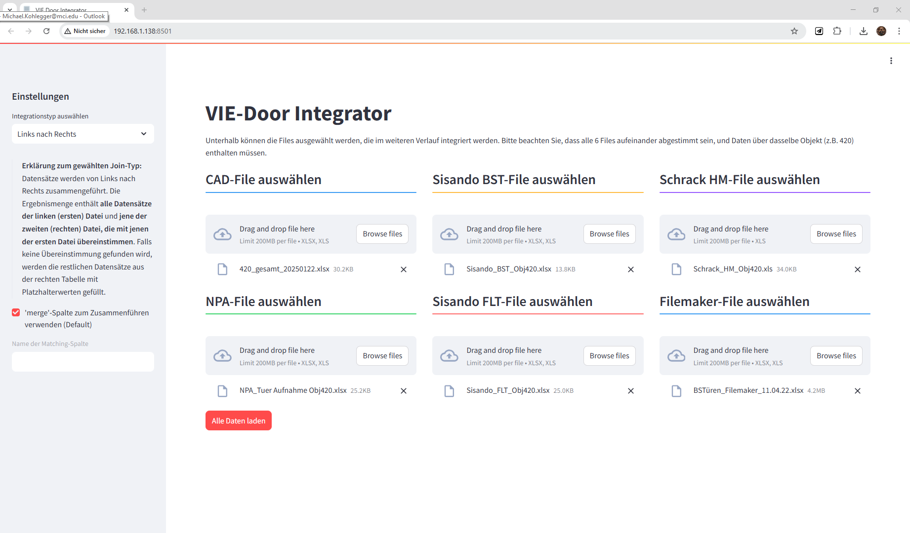

# VIE-Doors Integration ✈


Dieses Repository enthält Python Code zur Integration von Anlagendaten über Brandschutz- und Fluchttüren. Der Gesamte Code befindet sich im Modulordner `viedoors`. Die zu integrierenden Daten befinden sich im Ordner `data`. Als Frontend dient eine Streamlit-App, die wie folgt gestartet werden kann:

```sh
pip install -r requirements.txt
streamlit run streamlit_app.py
```

Anschließend kann im Webbrowser des Rechners direkt die **Webseite [http://localhost:8501](http://localhost:8501)** geöffnet werden, um die Streamlit App aufzurufen. Auf der Hauptseite der App können die zu integrierenden Datenfiles hochgeladen werden. Durch Klick auf den Button **"Alle Daten laden"** wird der Ladevorgang gestartet. Je nach Größe der Excel-Files kann dies einige Minuten dauern. Nach Abschluss des Ladevorgangs werden die Daten im Hintergrund anhand der AKS-Nummern zusammengeführt. Zuletzt kann durch Klick auf den Button **"Zusammengeführte Daten als Excel herunterladen"** der zusammengeführte Datensatz heruntergeladen werden.

